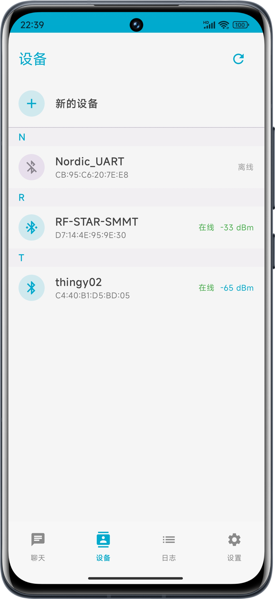
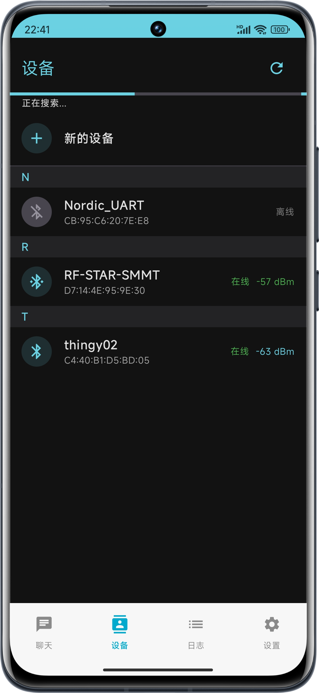

# JerryCan - BLE调试工具

<div align="center">
  
  <p>简洁、强大的Android蓝牙BLE调试工具</p>
  
  [](https://android-arsenal.com/api?level=23)
  [](LICENSE)
  [](https://github.com/yourusername/jerrycan/releases)
</div>

## 📱 应用简介

JerryCan是一个尝试提供简便BLE调试体验的开源工具。我们努力打造一个直观、易用的界面，提供类似nRF Connect和LightBlue的功能，但具有更友好的用户界面和更丰富的交互体验，希望能对BLE开发者有所帮助。应用采用Material Design设计规范，为开发者提供便捷的BLE功能调试体验。项目仍在不断完善中，期待社区的反馈和贡献。

### ✨ 主要特性

- **设备管理**：扫描、发现、连接和管理蓝牙BLE设备
- **服务浏览**：浏览并与GATT服务和特征交互
- **数据收发**：支持多种格式（HEX、ASCII、UTF-8等）的数据发送和接收
- **聊天功能**：展示与设备的历史消息交互记录
- **交互日志**：记录并展示手机与设备的通信日志
- **设置选项**：配置扫描时长、连接参数、显示设置等

## 📸 应用截图

<div align="center">
  <table>
    <tr>
      <td align="center"><br/>设备列表</td>
      <td align="center"><br/>服务列表</td>
      <td align="center"><br/>聊天界面</td>
    </tr>
    <tr>
      <td align="center"><br/>日志界面</td>
      <td align="center"><br/>设置界面</td>
      <td align="center"><br/>暗黑模式</td>
    </tr>
  </table>
</div>

## 🚀 快速开始

### 系统要求

- Android 6.0 (API level 23)或更高版本
- 支持BLE的Android设备

### 下载安装

- [从GitHub Releases下载](https://github.com/0xBitTwister/jerrycan/releases)

### 从源码构建

1. 克隆仓库：
```bash
git clone https://github.com/yourusername/jerrycan.git
cd jerrycan
```

2. 使用Android Studio打开项目：
   - 打开Android Studio
   - 选择"Open an existing Android Studio project"
   - 选择克隆的jerrycan目录

3. 构建并运行：
   - 连接Android设备或启动模拟器
   - 点击"Run"按钮或使用快捷键Shift+F10

## 🏗️ 应用架构

应用采用MVVM架构结合Clean Architecture设计原则，代码组织结构如下：

```
app/src/main/java/com/example/jerrycan/
├── bluetooth/        # 蓝牙功能实现
│   ├── scanner/      # 设备扫描
│   ├── connection/   # 设备连接
│   ├── gatt/         # GATT服务处理
│   └── manager/      # 蓝牙管理
├── data/             # 数据层
│   ├── repository/   # 数据仓库
│   ├── source/       # 数据源
│   └── mapper/       # 数据映射器
├── domain/           # 领域层
│   ├── usecase/      # 业务用例
│   └── service/      # 领域服务
├── model/            # 数据模型
├── navigation/       # 导航组件
├── ui/               # UI组件
│   ├── components/   # 可复用组件
│   ├── screens/      # 主屏幕
│   ├── dialogs/      # 对话框
│   └── theme/        # 主题定义
├── utils/            # 工具类
│   ├── bluetooth/    # 蓝牙工具
│   ├── extensions/   # Kotlin扩展
│   └── formatters/   # 格式化工具
└── viewmodel/        # ViewModel
    ├── chat/         # 聊天相关
    ├── device/       # 设备相关
    ├── logs/         # 日志相关
    └── settings/     # 设置相关
```

## 🛠️ 技术栈

- **UI**: Jetpack Compose
- **架构**: MVVM + Clean Architecture
- **依赖注入**: Hilt
- **异步处理**: Kotlin Coroutines & Flow
- **本地存储**: Room
- **导航**: Jetpack Navigation Compose
- **日期处理**: ThreeTenABP
- **单元测试**: JUnit4, Mockito, Turbine
- **UI测试**: Compose UI Test

## 📝 开发指南

### Cursor规则使用

本项目使用cursor.json文件定义代码组织规则和架构约束。开发者应遵循以下原则：

1. **遵循架构分层**：确保代码放置在正确的架构层次中
2. **命名规范**：按照cursor.json中定义的命名模式命名类和方法
3. **文档注释**：为类、接口和公开方法添加完整的KDoc注释
4. **多语言注释**：项目支持中文和英文注释，两种语言的注释都受欢迎

### 代码风格指南

1. **SOLID原则**：
   - 单一职责原则(SRP)：每个类只负责一项功能
   - 开闭原则(OCP)：对扩展开放，对修改关闭
   - 里氏替换原则(LSP)：子类可以替换父类
   - 接口隔离原则(ISP)：多个特定接口优于一个通用接口
   - 依赖倒置原则(DIP)：依赖抽象而非具体实现

2. **Kotlin编码规范**：
   - 使用Kotlin特性：数据类、扩展函数、作用域函数等
   - 空安全：正确使用可空类型和非空断言
   - 函数式编程：适当使用高阶函数和Lambda表达式

3. **Jetpack Compose指南**：
   - 可组合函数应保持简单，专注于单一责任
   - 状态提升：将状态提升到适当的层次
   - 使用remember和rememberSaveable缓存计算结果和保存状态

### BLE开发指南

1. **权限处理**：
   - 在Android 12+上正确请求BLUETOOTH_SCAN和BLUETOOTH_CONNECT权限
   - 在低版本Android上处理BLUETOOTH和BLUETOOTH_ADMIN权限

2. **设备连接最佳实践**：
   - 实现重连机制
   - 处理连接超时
   - 优雅处理断开连接

3. **GATT操作**：
   - 正确处理服务发现
   - 优化特征读写操作
   - 妥善处理通知和指示

## 🤝 参与贡献

我们非常欢迎社区贡献，无论是小的修复还是新的功能。以下是贡献指南：

1. **Fork仓库并创建特性分支**：
   ```bash
   git checkout -b feature/amazing-feature
   ```

2. **遵循代码规范**：
   - 按照代码风格和架构规范进行开发
   - 使用有意义的提交消息
   - 确保添加必要的测试用例

3. **提交更改**：
   ```bash
   git commit -m 'Add some amazing feature'
   git push origin feature/amazing-feature
   ```

4. **创建Pull Request**：
   - 提供清晰的描述说明您的更改
   - 确保通过所有测试
   - 如有必要，更新文档

5. **代码审查**：
   - 与维护者讨论可能的修改
   - 根据反馈进行调整

### 第一次贡献？

查看[如何贡献开源项目](https://github.com/firstcontributions/first-contributions)获取详细的步骤指南。

### 贡献者

感谢所有为项目做出贡献的人！

## 📄 版本历史

请查看[CHANGELOG.md](CHANGELOG.md)获取完整版本历史。

## 📜 许可证

本项目采用Apache 2.0许可证。详情请查看[LICENSE](LICENSE)文件。

## 🔗 相关资源

- [Android蓝牙开发指南](https://developer.android.com/guide/topics/connectivity/bluetooth-le)
- [Jetpack Compose文档](https://developer.android.com/jetpack/compose)
- [BLE调试工具比较](https://www.bluetooth.com/blog/tools-for-bluetooth-developers/)

## 📞 联系方式

如有任何问题或建议，请通过以下方式联系我们：

- **项目维护者**：[0xBitTwister](https://github.com/0xBitTwister)
- **电子邮件**：0xbytedancing@gmail.com

## 致谢

JerryCan项目在开发过程中受益于许多优秀的开源项目和设计灵感：

- [Nordic Common Libraries](https://github.com/NordicPlayground/Android-Common-Libraries) - 提供了优秀的BLE相关资源
- 感谢各类社交和聊天应用为我们提供的UI/UX设计灵感
- 特别感谢开源社区的所有贡献者，没有你们的工作，本项目将难以实现

本项目希望能够回馈开源社区，欢迎各位开发者在Apache 2.0许可证下自由使用、修改和分享本项目。
---

<div align="center">
  <p>如果这个项目对您有帮助，请给它一个⭐️</p>
  <p>Made with ❤️ by the JerryCan Team</p>
</div> 